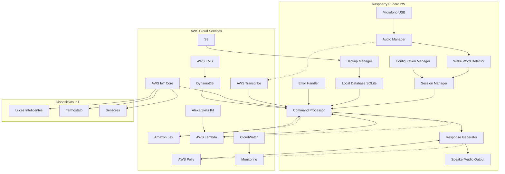
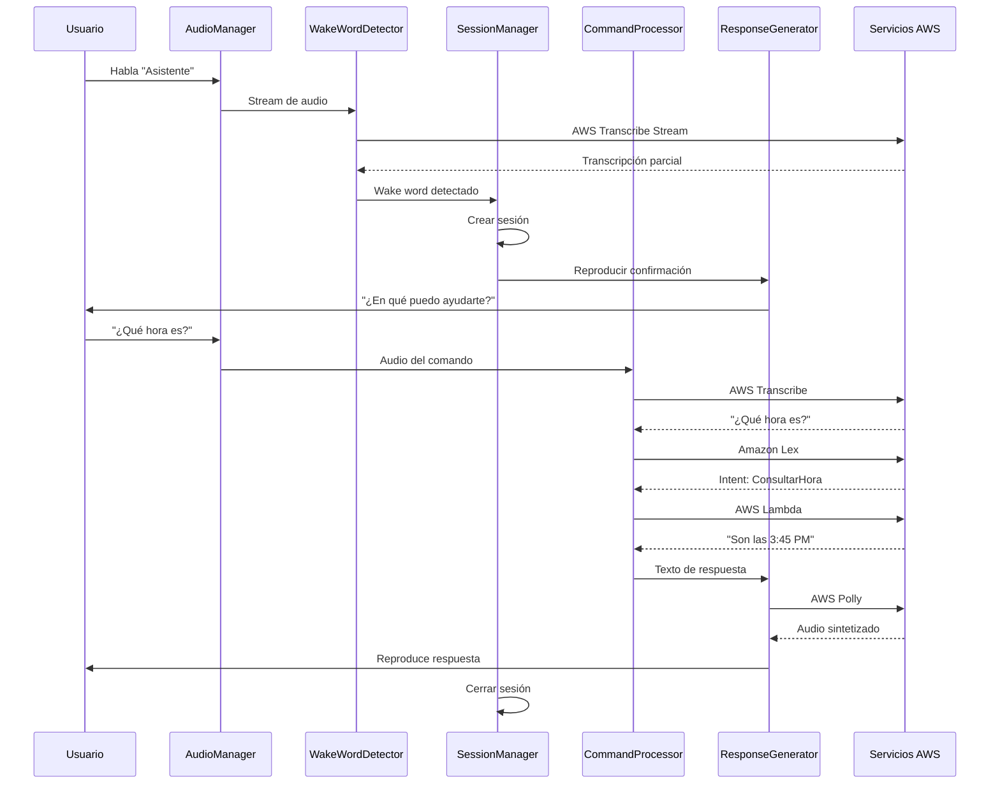

# Documento de Diseño: Asistente de Voz para Raspberry Pi

## Resumen

Este documento especifica el diseño técnico para un asistente de voz inteligente que se ejecuta en Raspberry Pi Zero 2W, utilizando servicios cognitivos de AWS para procesamiento de voz y lenguaje natural. El sistema implementa una arquitectura híbrida que combina procesamiento local para funciones básicas con servicios en la nube para capacidades avanzadas de IA.

## Arquitectura General

### Arquitectura de Alto Nivel



### Stack Tecnológico Seleccionado

**Lenguaje Principal:** Python 3.9+
- **Justificación:** Excelente soporte para Raspberry Pi, bibliotecas maduras para audio, integración nativa con AWS SDK
- **Bibliotecas clave:** boto3, pyaudio, asyncio, sqlite3, json

**Servicios AWS:**
- **AWS Transcribe:** Speech-to-Text con streaming en tiempo real
- **AWS Polly:** Text-to-Speech con voces neurales en español
- **Amazon Lex:** Procesamiento de lenguaje natural e intenciones
- **AWS Lambda:** Lógica de negocio serverless
- **AWS IoT Core:** Comunicación con dispositivos domóticos
- **DynamoDB:** Base de datos NoSQL para sincronización
- **Alexa Skills Kit:** Información contextual (clima, noticias)

**Hardware:**
- **Raspberry Pi Zero 2W:** Procesador ARM Cortex-A53 quad-core 1GHz, 512MB RAM
- **Micrófono USB:** Audio-Technica ATR2100x-USB o similar
- **Altavoz:** Altavoz USB o HAT de audio para Raspberry Pi
- **Carcasa:** Impresión 3D personalizada con ventilación

## Componentes y Interfaces

### 1. Audio Manager (audio_manager.py)

**Responsabilidades:**
- Gestión de dispositivos de audio (micrófono y altavoz)
- Captura continua de audio con buffer circular
- Calibración automática de niveles de audio
- Filtrado de ruido básico

**Interfaces:**
```python
class AudioManager:
    def __init__(self, sample_rate=16000, chunk_size=1024):
        pass
    
    def start_continuous_capture(self) -> None:
        """Inicia captura continua de audio"""
        pass
    
    def get_audio_chunk(self) -> bytes:
        """Obtiene chunk de audio del buffer"""
        pass
    
    def play_audio(self, audio_data: bytes) -> None:
        """Reproduce audio en el altavoz"""
        pass
    
    def calibrate_microphone(self) -> dict:
        """Calibra micrófono y retorna configuración"""
        pass
```

**Tecnologías:**
- **PyAudio:** Captura y reproducción de audio
- **NumPy:** Procesamiento de señales de audio
- **Threading:** Captura asíncrona de audio

### 2. Wake Word Detector (wake_word_detector.py)

**Responsabilidades:**
- Detección de palabra de activación usando AWS Transcribe streaming
- Gestión de conexión persistente con AWS Transcribe
- Filtrado de falsos positivos

**Interfaces:**
```python
class WakeWordDetector:
    def __init__(self, wake_words: List[str], confidence_threshold=0.8):
        pass
    
    async def start_detection(self, audio_stream) -> None:
        """Inicia detección continua de wake word"""
        pass
    
    def on_wake_word_detected(self, callback: Callable) -> None:
        """Registra callback para wake word detectado"""
        pass
    
    async def setup_transcribe_stream(self) -> None:
        """Configura stream de AWS Transcribe"""
        pass
```

**Tecnologías:**
- **boto3:** SDK de AWS para Transcribe
- **asyncio:** Procesamiento asíncrono de streams
- **websockets:** Conexión streaming con AWS

### 3. Session Manager (session_manager.py)

**Responsabilidades:**
- Gestión del ciclo de vida de sesiones de comando
- Control de timeouts y estados de sesión
- Coordinación entre componentes durante una sesión

**Interfaces:**
```python
class SessionManager:
    def __init__(self, session_timeout=30):
        pass
    
    def create_session(self) -> str:
        """Crea nueva sesión y retorna ID"""
        pass
    
    def get_active_session(self) -> Optional[Session]:
        """Obtiene sesión activa actual"""
        pass
    
    def close_session(self, session_id: str) -> None:
        """Cierra sesión específica"""
        pass
    
    def cleanup_expired_sessions(self) -> None:
        """Limpia sesiones expiradas"""
        pass
```

### 4. Command Processor (command_processor.py)

**Responsabilidades:**
- Procesamiento de comandos transcritos
- Integración con Amazon Lex para extracción de intenciones
- Invocación de AWS Lambda para lógica de negocio
- Manejo de respuestas y errores

**Interfaces:**
```python
class CommandProcessor:
    def __init__(self, lex_bot_name: str, lex_bot_alias: str):
        pass
    
    async def process_command(self, transcription: str, session_id: str) -> CommandResult:
        """Procesa comando transcrito y retorna resultado"""
        pass
    
    async def extract_intent(self, text: str) -> LexResponse:
        """Extrae intención usando Amazon Lex"""
        pass
    
    async def execute_intent(self, intent: str, entities: dict) -> Any:
        """Ejecuta lógica de negocio vía AWS Lambda"""
        pass
```

**Tecnologías:**
- **boto3:** Integración con Lex y Lambda
- **asyncio:** Procesamiento asíncrono
- **json:** Serialización de datos

### 5. Response Generator (response_generator.py)

**Responsabilidades:**
- Generación de respuestas textuales
- Síntesis de voz usando AWS Polly
- Cache de respuestas comunes
- Gestión de colas de reproducción

**Interfaces:**
```python
class ResponseGenerator:
    def __init__(self, polly_voice_id="Lupe", cache_enabled=True):
        pass
    
    async def generate_speech(self, text: str) -> bytes:
        """Genera audio desde texto usando AWS Polly"""
        pass
    
    def cache_response(self, text: str, audio_data: bytes) -> None:
        """Almacena respuesta en cache local"""
        pass
    
    async def play_response(self, text: str) -> None:
        """Genera y reproduce respuesta completa"""
        pass
```

### 6. IoT Controller (iot_controller.py)

**Responsabilidades:**
- Comunicación con dispositivos IoT vía AWS IoT Core
- Gestión de estados de dispositivos
- Publicación y suscripción a topics MQTT

**Interfaces:**
```python
class IoTController:
    def __init__(self, thing_name: str, endpoint: str):
        pass
    
    async def send_device_command(self, device_id: str, command: dict) -> bool:
        """Envía comando a dispositivo específico"""
        pass
    
    def subscribe_to_device_status(self, device_id: str, callback: Callable) -> None:
        """Suscribe a actualizaciones de estado"""
        pass
    
    async def get_device_status(self, device_id: str) -> dict:
        """Obtiene estado actual del dispositivo"""
        pass
```

### 7. Data Manager (data_manager.py)

**Responsabilidades:**
- Gestión de base de datos SQLite local
- Sincronización con DynamoDB
- Operaciones CRUD para recordatorios y configuración

**Interfaces:**
```python
class DataManager:
    def __init__(self, db_path: str, dynamodb_table: str):
        pass
    
    def save_reminder(self, reminder: Reminder) -> str:
        """Guarda recordatorio localmente"""
        pass
    
    async def sync_with_cloud(self) -> None:
        """Sincroniza datos locales con DynamoDB"""
        pass
    
    def get_pending_reminders(self) -> List[Reminder]:
        """Obtiene recordatorios pendientes"""
        pass
```

## Modelos de Datos

### Esquema SQLite Local

```sql
-- Tabla de recordatorios
CREATE TABLE reminders (
    id TEXT PRIMARY KEY,
    content TEXT NOT NULL,
    scheduled_time DATETIME NOT NULL,
    status TEXT DEFAULT 'pending',
    created_at DATETIME DEFAULT CURRENT_TIMESTAMP,
    synced_at DATETIME,
    user_id TEXT
);

-- Tabla de configuración
CREATE TABLE configuration (
    key TEXT PRIMARY KEY,
    value TEXT NOT NULL,
    updated_at DATETIME DEFAULT CURRENT_TIMESTAMP
);

-- Tabla de logs
CREATE TABLE logs (
    id INTEGER PRIMARY KEY AUTOINCREMENT,
    timestamp DATETIME DEFAULT CURRENT_TIMESTAMP,
    level TEXT NOT NULL,
    component TEXT NOT NULL,
    message TEXT NOT NULL,
    session_id TEXT,
    error_details TEXT
);

-- Tabla de dispositivos IoT
CREATE TABLE iot_devices (
    device_id TEXT PRIMARY KEY,
    device_name TEXT NOT NULL,
    device_type TEXT NOT NULL,
    last_status TEXT,
    last_seen DATETIME,
    is_online BOOLEAN DEFAULT FALSE
);
```

### Esquema DynamoDB

```python
# Tabla principal: voice-assistant-data
{
    "user_id": "string",  # Partition Key
    "item_type": "string",  # Sort Key (reminder, config, log)
    "item_id": "string",
    "content": "map",
    "timestamp": "number",
    "ttl": "number",  # Para expiración automática
    "status": "string"
}
```

### Modelos de Datos Python

```python
from dataclasses import dataclass
from datetime import datetime
from typing import Optional, Dict, Any

@dataclass
class Reminder:
    id: str
    content: str
    scheduled_time: datetime
    status: str = "pending"
    created_at: Optional[datetime] = None
    user_id: Optional[str] = None

@dataclass
class Session:
    id: str
    created_at: datetime
    last_activity: datetime
    status: str
    context: Dict[str, Any]

@dataclass
class CommandResult:
    success: bool
    response_text: str
    intent: Optional[str] = None
    entities: Optional[Dict] = None
    error: Optional[str] = None

@dataclass
class IoTDevice:
    device_id: str
    device_name: str
    device_type: str
    last_status: Dict[str, Any]
    last_seen: datetime
    is_online: bool
```

## Configuración del Sistema

### Archivo de Configuración (config.json)

```json
{
    "aws": {
        "region": "us-east-1",
        "transcribe": {
            "language_code": "es-ES",
            "sample_rate": 16000,
            "vocabulary_name": "voice-assistant-vocab"
        },
        "polly": {
            "voice_id": "Lupe",
            "output_format": "mp3",
            "sample_rate": "22050"
        },
        "lex": {
            "bot_name": "VoiceAssistantBot",
            "bot_alias": "PROD",
            "locale_id": "es_ES"
        },
        "iot": {
            "thing_name": "raspberry-voice-assistant",
            "endpoint": "your-iot-endpoint.amazonaws.com"
        },
        "dynamodb": {
            "table_name": "voice-assistant-data",
            "region": "us-east-1"
        }
    },
    "audio": {
        "sample_rate": 16000,
        "chunk_size": 1024,
        "channels": 1,
        "input_device_index": null,
        "output_device_index": null
    },
    "wake_words": ["asistente", "alexa", "hola asistente"],
    "session": {
        "timeout_seconds": 30,
        "max_command_length_seconds": 10
    },
    "features": {
        "cloud_sync_enabled": true,
        "iot_control_enabled": true,
        "voice_cache_enabled": true,
        "debug_logging": false
    }
}
```

### Variables de Entorno

```bash
# Credenciales AWS
AWS_ACCESS_KEY_ID=your_access_key
AWS_SECRET_ACCESS_KEY=your_secret_key
AWS_DEFAULT_REGION=us-east-1

# Configuración específica
VOICE_ASSISTANT_USER_ID=user_001
VOICE_ASSISTANT_LOG_LEVEL=INFO
VOICE_ASSISTANT_CONFIG_PATH=/home/pi/voice-assistant/config.json

# Certificados IoT (si se usan)
IOT_CERTIFICATE_PATH=/home/pi/certs/certificate.pem.crt
IOT_PRIVATE_KEY_PATH=/home/pi/certs/private.pem.key
IOT_ROOT_CA_PATH=/home/pi/certs/root-CA.crt
```

## Flujo de Procesamiento Principal

### Diagrama de Secuencia - Comando Completo



## Manejo de Errores y Recuperación

### Estrategias de Resilencia

**1. Modo Degradado:**
```python
class DegradedModeManager:
    def __init__(self):
        self.available_services = set()
        self.fallback_responses = {}
    
    def check_service_availability(self) -> Dict[str, bool]:
        """Verifica qué servicios AWS están disponibles"""
        pass
    
    def get_fallback_response(self, intent: str) -> str:
        """Retorna respuesta local cuando AWS no está disponible"""
        pass
```

**2. Reintentos con Backoff Exponencial:**
```python
import asyncio
from typing import Callable, Any

async def retry_with_backoff(
    func: Callable,
    max_retries: int = 3,
    base_delay: float = 1.0,
    max_delay: float = 60.0
) -> Any:
    """Ejecuta función con reintentos y backoff exponencial"""
    for attempt in range(max_retries):
        try:
            return await func()
        except Exception as e:
            if attempt == max_retries - 1:
                raise e
            
            delay = min(base_delay * (2 ** attempt), max_delay)
            await asyncio.sleep(delay)
```

**3. Circuit Breaker Pattern:**
```python
class CircuitBreaker:
    def __init__(self, failure_threshold: int = 5, timeout: int = 60):
        self.failure_threshold = failure_threshold
        self.timeout = timeout
        self.failure_count = 0
        self.last_failure_time = None
        self.state = "CLOSED"  # CLOSED, OPEN, HALF_OPEN
```

## Seguridad

### Medidas de Seguridad Implementadas

**1. Cifrado de Datos:**
- Todas las comunicaciones con AWS usan TLS 1.2+
- Datos sensibles en DynamoDB cifrados con AWS KMS
- Credenciales almacenadas en variables de entorno

**2. Autenticación y Autorización:**
- IAM roles con permisos mínimos necesarios
- Rotación automática de credenciales
- Certificados X.509 para AWS IoT Core

**3. Privacidad:**
- Audio procesado solo cuando se detecta wake word
- Eliminación automática de archivos de audio temporales
- Opción de deshabilitar logs en la nube

### Configuración IAM Recomendada

```json
{
    "Version": "2012-10-17",
    "Statement": [
        {
            "Effect": "Allow",
            "Action": [
                "transcribe:StartStreamTranscription",
                "polly:SynthesizeSpeech",
                "lex:PostText",
                "lex:PostContent"
            ],
            "Resource": "*"
        },
        {
            "Effect": "Allow",
            "Action": [
                "lambda:InvokeFunction"
            ],
            "Resource": "arn:aws:lambda:*:*:function:voice-assistant-*"
        },
        {
            "Effect": "Allow",
            "Action": [
                "dynamodb:GetItem",
                "dynamodb:PutItem",
                "dynamodb:UpdateItem",
                "dynamodb:DeleteItem",
                "dynamodb:Query"
            ],
            "Resource": "arn:aws:dynamodb:*:*:table/voice-assistant-data"
        },
        {
            "Effect": "Allow",
            "Action": [
                "iot:Publish",
                "iot:Subscribe",
                "iot:Connect",
                "iot:Receive"
            ],
            "Resource": "*"
        }
    ]
}
```


## Propiedades de Corrección

Una propiedad es una característica o comportamiento que debe mantenerse verdadero en todas las ejecuciones válidas del sistema - esencialmente, una declaración formal sobre lo que el sistema debe hacer. Las propiedades sirven como puente entre las especificaciones legibles por humanos y las garantías de corrección verificables por máquina.

### Reflexión sobre Propiedades

Después de analizar todos los criterios de aceptación, he identificado las siguientes redundancias y consolidaciones:

**Propiedades Consolidadas:**
- Las propiedades 2.1, 2.2 y 2.3 (captura de comando) se pueden consolidar en una sola propiedad sobre el ciclo completo de captura
- Las propiedades 5.1 y 5.2 (control de dispositivos IoT) se pueden consolidar en una propiedad general sobre comandos IoT
- Las propiedades 6.2 y 6.4 (almacenamiento de recordatorios y alarmas) son esencialmente la misma operación de round-trip
- Las propiedades 7.1 y 7.2 (síntesis y reproducción) se pueden consolidar en el flujo completo de respuesta

**Propiedades Eliminadas por Redundancia:**
- La propiedad 11.1 (crear contexto de sesión) está implícita en 1.3 (iniciar sesión de comando)
- La propiedad 11.3 (limpiar contexto) está implícita en 8.3 (finalizar sesión)

### Propiedades Identificadas

#### Propiedad 1: Detección de Wake Word Inicia Sesión
*Para cualquier* stream de audio que contenga el wake word configurado, cuando AWS Transcribe lo detecta, el sistema debe crear una nueva sesión de comando con ID único y timestamp, y reproducir confirmación audible.

**Valida: Requisitos 1.3, 1.4**

#### Propiedad 2: Captura Completa de Comando
*Para cualquier* sesión activa, el sistema debe capturar audio continuamente hasta que AWS Transcribe detecte silencio, almacenar la transcripción final, y enviarla para procesamiento de intención.

**Valida: Requisitos 2.1, 2.2, 2.3**

#### Propiedad 3: Procesamiento de Intención con Alta Confianza
*Para cualquier* transcripción recibida, cuando Amazon Lex retorna una intención con alta confianza (>0.8), el sistema debe invocar la AWS Lambda correspondiente sin solicitar aclaraciones.

**Valida: Requisitos 3.1, 3.4**

#### Propiedad 4: Inclusión de Ubicación en Consultas de Clima
*Para cualquier* solicitud de información del clima, el sistema debe incluir la ubicación del usuario configurada en la llamada a Alexa Skills Kit.

**Valida: Requisitos 4.4**

#### Propiedad 5: Comandos IoT Publicados a AWS IoT Core
*Para cualquier* comando de control de dispositivo domótico (luces, temperatura, etc.), el sistema debe publicar un mensaje MQTT al topic correspondiente en AWS IoT Core y confirmar verbalmente la acción.

**Valida: Requisitos 5.1, 5.2, 5.3**

#### Propiedad 6: Consulta de Estado de Dispositivos IoT
*Para cualquier* dispositivo IoT registrado, el sistema debe consultar periódicamente su estado vía AWS IoT Core y mantener un registro actualizado localmente.

**Valida: Requisitos 5.5**

#### Propiedad 7: Round-Trip de Recordatorios
*Para cualquier* recordatorio creado por el usuario, almacenarlo en SQLite local y sincronizarlo con DynamoDB debe permitir recuperar el mismo recordatorio con contenido y tiempo idénticos.

**Valida: Requisitos 6.1, 6.2, 6.4**

#### Propiedad 8: Ejecución de Recordatorios en Tiempo Programado
*Para cualquier* recordatorio con tiempo programado alcanzado, el sistema debe generar una alerta audible usando AWS Polly con el mensaje del recordatorio.

**Valida: Requisitos 6.3**

#### Propiedad 9: Operaciones CRUD de Recordatorios
*Para cualquier* recordatorio almacenado, el sistema debe permitir listar, modificar y cancelar el recordatorio consultando primero SQLite local antes de sincronizar con DynamoDB.

**Valida: Requisitos 6.5**

#### Propiedad 10: Flujo Completo de Respuesta de Voz
*Para cualquier* respuesta textual generada, el sistema debe enviarla a AWS Polly para síntesis, reproducir el audio inmediatamente, y retornar al modo de escucha continua al finalizar.

**Valida: Requisitos 7.1, 7.2, 7.4**

#### Propiedad 11: Cache de Respuestas Comunes
*Para cualquier* respuesta textual que se haya sintetizado previamente, el sistema debe reutilizar el audio cacheado localmente en lugar de llamar a AWS Polly nuevamente.

**Valida: Requisitos 7.5**

#### Propiedad 12: Finalización de Sesión en Error
*Para cualquier* error que ocurra durante una sesión activa, el sistema debe finalizar la sesión, registrar el error en SQLite local, y retornar al modo de escucha continua.

**Valida: Requisitos 8.3, 8.4**

#### Propiedad 13: Limpieza de Archivos de Audio Temporales
*Para cualquier* archivo de audio temporal creado durante el procesamiento, el sistema debe eliminarlo automáticamente después de un procesamiento exitoso.

**Valida: Requisitos 10.3**

#### Propiedad 14: Respeto de Configuración de Privacidad
*Para cualquier* configuración de privacidad establecida por el usuario (ej: deshabilitar logs en DynamoDB), el sistema debe respetar esa configuración y no sincronizar datos deshabilitados.

**Valida: Requisitos 10.4**

#### Propiedad 15: Mantenimiento de Historial de Sesión
*Para cualquier* sesión activa, el sistema debe mantener un historial completo de la conversación (comandos y respuestas) hasta que la sesión finalice.

**Valida: Requisitos 11.2**

#### Propiedad 16: Timeout de Sesiones Inactivas
*Para cualquier* sesión que no tenga actividad durante 30 segundos, el sistema debe finalizar automáticamente la sesión y limpiar su contexto.

**Valida: Requisitos 11.4**

#### Propiedad 17: Sincronización de Idioma entre Servicios
*Para cualquier* idioma detectado por AWS Transcribe, el sistema debe configurar AWS Polly y Amazon Lex para usar el mismo idioma en las respuestas.

**Valida: Requisitos 12.2, 12.4**

## Estrategia de Pruebas

### Enfoque Dual de Testing

El sistema utilizará un enfoque dual que combina:

**1. Pruebas Unitarias:** Para verificar ejemplos específicos, casos edge y condiciones de error
**2. Pruebas Basadas en Propiedades:** Para verificar propiedades universales a través de múltiples entradas generadas

Ambos tipos de pruebas son complementarios y necesarios para cobertura completa. Las pruebas unitarias capturan bugs concretos, mientras que las pruebas de propiedades verifican corrección general.

### Framework de Property-Based Testing

**Biblioteca Seleccionada:** Hypothesis (Python)
- Generación automática de casos de prueba
- Shrinking automático de casos fallidos
- Integración con pytest
- Soporte para tipos complejos

**Configuración:**
```python
from hypothesis import given, settings, strategies as st

# Configuración global para todas las pruebas de propiedades
settings.register_profile("ci", max_examples=100, deadline=None)
settings.load_profile("ci")
```

### Estructura de Pruebas

```
tests/
├── unit/
│   ├── test_audio_manager.py
│   ├── test_wake_word_detector.py
│   ├── test_session_manager.py
│   ├── test_command_processor.py
│   ├── test_response_generator.py
│   ├── test_iot_controller.py
│   └── test_data_manager.py
├── property/
│   ├── test_properties_wake_word.py
│   ├── test_properties_command_processing.py
│   ├── test_properties_reminders.py
│   ├── test_properties_iot.py
│   └── test_properties_session.py
├── integration/
│   ├── test_end_to_end_flow.py
│   ├── test_aws_integration.py
│   └── test_iot_integration.py
└── fixtures/
    ├── audio_samples.py
    ├── mock_aws_responses.py
    └── test_data.py
```

### Ejemplos de Pruebas de Propiedades

#### Propiedad 7: Round-Trip de Recordatorios

```python
# Feature: asistente-voz-raspberry, Property 7: Round-Trip de Recordatorios
from hypothesis import given, strategies as st
from datetime import datetime, timedelta
import pytest

@given(
    content=st.text(min_size=1, max_size=200),
    scheduled_time=st.datetimes(
        min_value=datetime.now(),
        max_value=datetime.now() + timedelta(days=365)
    )
)
@settings(max_examples=100)
def test_reminder_round_trip(content, scheduled_time):
    """
    Para cualquier recordatorio creado, almacenarlo y recuperarlo
    debe retornar el mismo contenido y tiempo programado.
    """
    # Arrange
    data_manager = DataManager(db_path=":memory:", dynamodb_table="test-table")
    reminder = Reminder(
        id=str(uuid.uuid4()),
        content=content,
        scheduled_time=scheduled_time
    )
    
    # Act
    saved_id = data_manager.save_reminder(reminder)
    retrieved_reminder = data_manager.get_reminder(saved_id)
    
    # Assert
    assert retrieved_reminder.content == content
    assert retrieved_reminder.scheduled_time == scheduled_time
    assert retrieved_reminder.id == saved_id
```

#### Propiedad 11: Cache de Respuestas Comunes

```python
# Feature: asistente-voz-raspberry, Property 11: Cache de Respuestas Comunes
from hypothesis import given, strategies as st

@given(response_text=st.text(min_size=1, max_size=500))
@settings(max_examples=100)
def test_response_caching(response_text, mocker):
    """
    Para cualquier respuesta sintetizada previamente, debe reutilizarse
    el audio cacheado sin llamar a AWS Polly nuevamente.
    """
    # Arrange
    mock_polly = mocker.patch('boto3.client')
    response_generator = ResponseGenerator(cache_enabled=True)
    
    # Act - Primera síntesis
    audio_1 = await response_generator.generate_speech(response_text)
    polly_calls_first = mock_polly.call_count
    
    # Act - Segunda síntesis (debe usar cache)
    audio_2 = await response_generator.generate_speech(response_text)
    polly_calls_second = mock_polly.call_count
    
    # Assert
    assert audio_1 == audio_2  # Mismo audio
    assert polly_calls_second == polly_calls_first  # No llamadas adicionales a Polly
```

#### Propiedad 16: Timeout de Sesiones Inactivas

```python
# Feature: asistente-voz-raspberry, Property 16: Timeout de Sesiones Inactivas
from hypothesis import given, strategies as st
import asyncio

@given(inactive_seconds=st.integers(min_value=31, max_value=120))
@settings(max_examples=100)
async def test_session_timeout(inactive_seconds):
    """
    Para cualquier sesión inactiva por más de 30 segundos,
    debe finalizarse automáticamente.
    """
    # Arrange
    session_manager = SessionManager(session_timeout=30)
    session_id = session_manager.create_session()
    
    # Act
    await asyncio.sleep(inactive_seconds)
    session_manager.cleanup_expired_sessions()
    
    # Assert
    active_session = session_manager.get_active_session()
    assert active_session is None  # Sesión debe estar cerrada
```

### Pruebas Unitarias para Casos Edge

#### Edge Case: Transcripción Vacía

```python
def test_empty_transcription_requests_repeat():
    """
    Cuando la transcripción está vacía, el sistema debe solicitar
    al usuario que repita el comando.
    """
    # Arrange
    command_processor = CommandProcessor(lex_bot_name="test-bot", lex_bot_alias="test")
    session_id = "test-session-123"
    
    # Act
    result = await command_processor.process_command("", session_id)
    
    # Assert
    assert result.success is False
    assert "repite" in result.response_text.lower()
```

#### Edge Case: Dispositivo IoT No Responde

```python
@pytest.mark.asyncio
async def test_iot_device_timeout():
    """
    Cuando un dispositivo IoT no responde en 5 segundos,
    el sistema debe informar al usuario del fallo.
    """
    # Arrange
    iot_controller = IoTController(thing_name="test-thing", endpoint="test-endpoint")
    device_id = "light-001"
    command = {"action": "turn_on"}
    
    # Mock device that doesn't respond
    with patch.object(iot_controller, '_wait_for_response', side_effect=asyncio.TimeoutError):
        # Act
        result = await iot_controller.send_device_command(device_id, command)
        
        # Assert
        assert result is False
```

#### Edge Case: Modo Degradado por Falla de AWS

```python
def test_degraded_mode_on_aws_failure():
    """
    Cuando los servicios de AWS no están disponibles,
    el sistema debe operar en modo degradado.
    """
    # Arrange
    degraded_manager = DegradedModeManager()
    
    # Simulate AWS service failures
    with patch('boto3.client', side_effect=ConnectionError):
        # Act
        available_services = degraded_manager.check_service_availability()
        
        # Assert
        assert available_services['transcribe'] is False
        assert available_services['polly'] is False
        assert degraded_manager.is_degraded_mode() is True
```

### Pruebas de Integración

#### Flujo End-to-End Completo

```python
@pytest.mark.integration
async def test_complete_voice_command_flow():
    """
    Prueba el flujo completo desde wake word hasta respuesta.
    """
    # Arrange
    system = VoiceAssistantSystem(config_path="test_config.json")
    await system.initialize()
    
    # Act - Simular wake word
    await system.audio_manager.inject_audio(load_audio_sample("wake_word.wav"))
    await asyncio.sleep(0.5)
    
    # Act - Simular comando
    await system.audio_manager.inject_audio(load_audio_sample("what_time_is_it.wav"))
    await asyncio.sleep(2)
    
    # Assert
    assert system.session_manager.get_active_session() is not None
    assert system.last_response is not None
    assert "hora" in system.last_response.lower()
```

### Estrategia de Mocking para AWS

Para evitar costos y dependencias externas durante las pruebas:

```python
# fixtures/mock_aws_responses.py
import boto3
from moto import mock_transcribe, mock_polly, mock_lex, mock_dynamodb, mock_iot

@pytest.fixture
def mock_aws_services():
    """Mock de todos los servicios AWS necesarios"""
    with mock_transcribe(), mock_polly(), mock_lex(), mock_dynamodb(), mock_iot():
        yield
```

### Cobertura de Código

**Objetivo:** Mínimo 85% de cobertura de código

```bash
# Ejecutar pruebas con cobertura
pytest --cov=src --cov-report=html --cov-report=term

# Generar reporte detallado
coverage report -m
```

### Integración Continua

```yaml
# .github/workflows/tests.yml
name: Tests

on: [push, pull_request]

jobs:
  test:
    runs-on: ubuntu-latest
    steps:
      - uses: actions/checkout@v2
      - name: Set up Python
        uses: actions/setup-python@v2
        with:
          python-version: '3.9'
      - name: Install dependencies
        run: |
          pip install -r requirements.txt
          pip install -r requirements-dev.txt
      - name: Run unit tests
        run: pytest tests/unit -v
      - name: Run property tests
        run: pytest tests/property -v --hypothesis-profile=ci
      - name: Run integration tests
        run: pytest tests/integration -v
      - name: Generate coverage report
        run: pytest --cov=src --cov-report=xml
      - name: Upload coverage to Codecov
        uses: codecov/codecov-action@v2
```

## Manejo de Errores

### Categorías de Errores

**1. Errores de Hardware:**
- Micrófono no disponible
- Altavoz no funcional
- Problemas de audio (ruido excesivo, volumen bajo)

**2. Errores de Red:**
- Pérdida de conexión a internet
- Timeout en llamadas a AWS
- Latencia alta

**3. Errores de Servicios AWS:**
- AWS Transcribe no disponible
- AWS Polly falla en síntesis
- Amazon Lex no responde
- AWS IoT Core desconectado

**4. Errores de Datos:**
- Base de datos SQLite corrupta
- Falla en sincronización con DynamoDB
- Datos inválidos en configuración

**5. Errores de Lógica:**
- Intención no reconocida
- Entidades faltantes o inválidas
- Comando ambiguo

### Estrategias de Manejo

```python
class ErrorHandler:
    def __init__(self):
        self.error_counts = defaultdict(int)
        self.last_errors = {}
    
    async def handle_error(self, error: Exception, context: dict) -> ErrorResponse:
        """Maneja error según su tipo y contexto"""
        error_type = type(error).__name__
        self.error_counts[error_type] += 1
        self.last_errors[error_type] = {
            'timestamp': datetime.now(),
            'context': context,
            'message': str(error)
        }
        
        if isinstance(error, NetworkError):
            return await self._handle_network_error(error, context)
        elif isinstance(error, AWSServiceError):
            return await self._handle_aws_error(error, context)
        elif isinstance(error, HardwareError):
            return await self._handle_hardware_error(error, context)
        else:
            return await self._handle_generic_error(error, context)
    
    async def _handle_network_error(self, error, context):
        """Maneja errores de red con reintentos"""
        if self.error_counts['NetworkError'] < 3:
            await asyncio.sleep(2 ** self.error_counts['NetworkError'])
            return ErrorResponse(retry=True, user_message=None)
        else:
            return ErrorResponse(
                retry=False,
                user_message="No puedo conectarme a internet. Verifica tu conexión.",
                fallback_mode=True
            )
```

## Optimizaciones de Rendimiento

### 1. Streaming de Audio Eficiente

```python
class AudioStreamOptimizer:
    def __init__(self, chunk_size=1024, buffer_size=10):
        self.chunk_size = chunk_size
        self.buffer = deque(maxlen=buffer_size)
    
    def optimize_stream(self, audio_data: bytes) -> bytes:
        """Optimiza stream de audio para reducir latencia"""
        # Aplicar compresión si es necesario
        # Reducir ruido de fondo
        # Normalizar volumen
        return processed_audio
```

### 2. Cache Multinivel

```python
class MultiLevelCache:
    def __init__(self):
        self.memory_cache = {}  # Cache en memoria (rápido)
        self.disk_cache_path = "/tmp/voice_cache"  # Cache en disco (persistente)
    
    async def get(self, key: str) -> Optional[bytes]:
        """Obtiene valor del cache con fallback"""
        # Intenta memoria primero
        if key in self.memory_cache:
            return self.memory_cache[key]
        
        # Luego disco
        disk_value = await self._read_from_disk(key)
        if disk_value:
            self.memory_cache[key] = disk_value  # Promociona a memoria
            return disk_value
        
        return None
```

### 3. Procesamiento Asíncrono

```python
class AsyncProcessor:
    def __init__(self, max_workers=4):
        self.executor = ThreadPoolExecutor(max_workers=max_workers)
        self.loop = asyncio.get_event_loop()
    
    async def process_parallel(self, tasks: List[Callable]) -> List[Any]:
        """Procesa múltiples tareas en paralelo"""
        futures = [
            self.loop.run_in_executor(self.executor, task)
            for task in tasks
        ]
        return await asyncio.gather(*futures)
```

## Monitoreo y Observabilidad

### Métricas Clave

```python
class MetricsCollector:
    def __init__(self):
        self.metrics = {
            'wake_word_detections': 0,
            'commands_processed': 0,
            'successful_responses': 0,
            'errors': defaultdict(int),
            'avg_response_time': 0,
            'aws_api_calls': defaultdict(int)
        }
    
    def record_metric(self, metric_name: str, value: Any):
        """Registra métrica para análisis"""
        self.metrics[metric_name] = value
    
    async def send_to_cloudwatch(self):
        """Envía métricas a CloudWatch"""
        cloudwatch = boto3.client('cloudwatch')
        # Enviar métricas...
```

### Logging Estructurado

```python
import structlog

logger = structlog.get_logger()

logger.info(
    "command_processed",
    session_id=session_id,
    intent=intent,
    confidence=confidence,
    response_time_ms=response_time
)
```

## Despliegue y Configuración

### Instalación en Raspberry Pi

```bash
#!/bin/bash
# install.sh

# Actualizar sistema
sudo apt-get update
sudo apt-get upgrade -y

# Instalar dependencias del sistema
sudo apt-get install -y python3-pip python3-dev portaudio19-dev

# Instalar dependencias de Python
pip3 install -r requirements.txt

# Configurar variables de entorno
cp .env.example .env
nano .env  # Editar con credenciales AWS

# Crear base de datos local
python3 scripts/init_database.py

# Configurar servicio systemd
sudo cp voice-assistant.service /etc/systemd/system/
sudo systemctl enable voice-assistant
sudo systemctl start voice-assistant
```

### Servicio Systemd

```ini
# voice-assistant.service
[Unit]
Description=Voice Assistant Service
After=network.target

[Service]
Type=simple
User=pi
WorkingDirectory=/home/pi/voice-assistant
ExecStart=/usr/bin/python3 /home/pi/voice-assistant/main.py
Restart=always
RestartSec=10
Environment="PYTHONUNBUFFERED=1"

[Install]
WantedBy=multi-user.target
```

### Configuración de Auto-inicio

```python
# main.py
import asyncio
import signal
import sys

async def main():
    # Inicializar sistema
    system = VoiceAssistantSystem(config_path="config.json")
    
    # Configurar manejo de señales
    def signal_handler(sig, frame):
        logger.info("Shutting down gracefully...")
        asyncio.create_task(system.shutdown())
    
    signal.signal(signal.SIGINT, signal_handler)
    signal.signal(signal.SIGTERM, signal_handler)
    
    # Iniciar sistema
    await system.initialize()
    await system.run()

if __name__ == "__main__":
    asyncio.run(main())
```

## Consideraciones de Costos AWS

### Estimación de Costos Mensuales

**AWS Transcribe:**
- Streaming: $0.024 por minuto
- Uso estimado: 2 horas/día = 60 horas/mes = 3,600 minutos
- Costo: $86.40/mes

**AWS Polly:**
- Voces neurales: $16 por 1 millón de caracteres
- Uso estimado: 50,000 caracteres/mes
- Costo: $0.80/mes

**Amazon Lex:**
- $0.004 por solicitud de voz
- Uso estimado: 300 comandos/mes
- Costo: $1.20/mes

**AWS IoT Core:**
- $1 por millón de mensajes
- Uso estimado: 10,000 mensajes/mes
- Costo: $0.01/mes

**DynamoDB:**
- On-demand: $1.25 por millón de escrituras
- Uso estimado: 1,000 escrituras/mes
- Costo: $0.00125/mes

**Total Estimado: ~$88.50/mes**

### Optimizaciones de Costo

1. **Cache agresivo de respuestas comunes** - Reduce llamadas a Polly
2. **Detección local de wake word** - Reduce uso de Transcribe (si se implementa)
3. **Batch de sincronización con DynamoDB** - Reduce escrituras
4. **Uso de Lambda en lugar de EC2** - Pago por uso real

## Conclusión

Este diseño proporciona una arquitectura robusta, escalable y eficiente para un asistente de voz en Raspberry Pi. La combinación de procesamiento local y servicios en la nube de AWS permite un balance óptimo entre capacidades avanzadas de IA y costos operativos razonables.

Las propiedades de corrección definidas aseguran que el sistema se comporte correctamente en todos los escenarios, mientras que la estrategia de pruebas dual (unitarias + propiedades) garantiza cobertura completa y confiabilidad del sistema.