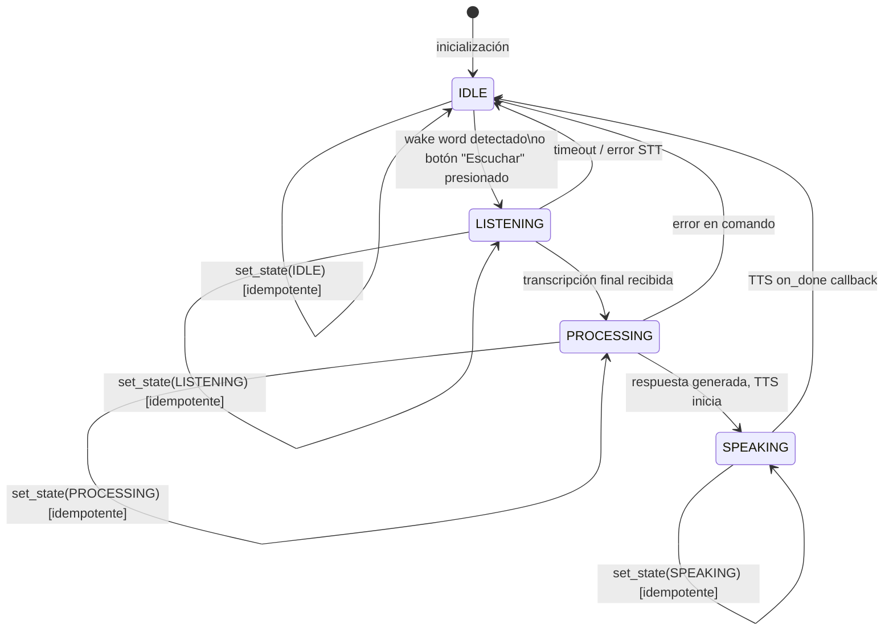

# Design Document: GUI Avatar Fase 1 Offline

## Overview

Este documento describe el diseño técnico de la migración de "Asistonto" desde su interfaz de terminal hacia una GUI moderna con avatar visual interactivo. La Fase 1 opera completamente offline: Vosk para STT, pyttsx3 para TTS, y un manejador de comandos locales para hora, chistes y apertura de aplicaciones.

### Decisión de Framework UI: CustomTkinter vs PyQt6

| Criterio | CustomTkinter | PyQt6 |
|---|---|---|
| Instalación | `pip install customtkinter` (~2 MB) | `pip install PyQt6` (~60 MB) |
| Curva de aprendizaje | Baja — API similar a tkinter estándar | Media-alta — señales/slots, QML opcional |
| Estética modo oscuro | Nativa, sin configuración extra | Requiere QSS stylesheet manual |
| Threading con GUI | `tkinter.after()` + `queue.Queue` | `QTimer` + `QThread` / señales |
| Compatibilidad Windows | Excelente (tkinter incluido en CPython) | Buena, pero requiere DLLs adicionales |
| Overhead de dependencias | Mínimo | Significativo |
| Canvas 2D para animaciones | `tk.Canvas` nativo, maduro | `QGraphicsScene` más complejo |

**Elección: CustomTkinter.** Para Fase 1, la prioridad es velocidad de desarrollo, instalación sin fricción y animaciones 2D simples en Canvas. CustomTkinter entrega modo oscuro nativo y una API familiar sin el overhead de Qt. PyQt6 sería preferible si se necesitara QML, OpenGL o una arquitectura MVC más formal en fases futuras.

---

## Architecture

### Diagrama de Componentes de Alto Nivel

```mermaid
graph TD
    subgraph "Main Thread (GUI)"
        MW[MainWindow\nctk.CTk]
        AW[AvatarWidget\nCanvas + animaciones]
        CL[ChatLogWidget\nctk.CTkTextbox]
        TH[theme.py\nConstantes de color]
        POLL[after(50ms)\nqueue polling]
    end

    subgraph "Audio Thread (daemon)"
        STT[STTEngine\nVosk KaldiRecognizer]
        AM[AudioManager\nPyAudio buffer circular]
    end

    subgraph "TTS Thread (daemon)"
        TTS[TTSEngine\npyttsx3]
    end

    subgraph "Logic Layer"
        OCH[OfflineCommandHandler\nregex + datetime + subprocess]
        RM[ResourceManager\nsignal + WM_DELETE_WINDOW]
        VGUI[VoiceAssistantGUI\norquestador]
    end

    AM -->|chunks PCM| STT
    STT -->|GUIEvent via queue.Queue| POLL
    POLL -->|dispatch| MW
    MW --> AW
    MW --> CL
    VGUI -->|handle()| OCH
    OCH -->|respuesta str| VGUI
    VGUI -->|speak()| TTS
    TTS -->|on_done callback via after(0)| MW
    RM -->|shutdown()| VGUI
    TH -.->|colores/fuentes| MW
    TH -.->|colores/fuentes| AW
    TH -.->|colores/fuentes| CL
```

### Flujo de Datos Principal

```
Micrófono → AudioManager.get_audio_chunk()
         → STTEngine (Vosk KaldiRecognizer)
         → transcripción parcial/final
         → detección wake word (SequenceMatcher ≥ 0.70)
         → GUIEvent(TRANSCRIPTION) → queue.Queue
         → MainWindow._poll_queue() [cada 50ms]
         → VoiceAssistantGUI.handle_transcription()
         → OfflineCommandHandler.handle(text)
         → respuesta str
         → ChatLogWidget.add_assistant_message()
         → TTSEngine.speak(text, on_done)
         → [TTS Thread] pyttsx3.runAndWait()
         → on_done() via root.after(0, ...)
         → Avatar → IDLE
```


### Máquina de Estados del Avatar



**Invariante**: El avatar se encuentra en exactamente uno de {IDLE, LISTENING, PROCESSING, SPEAKING} en todo momento. Las transiciones al mismo estado son no-operaciones (idempotentes).

---

## Components and Interfaces

### `src/gui/theme.py`

Módulo de constantes puras — sin clases, sin estado.

```python
# Paleta de colores
BG_PRIMARY    = "#1a1a2e"   # Fondo principal de la ventana
BG_SECONDARY  = "#16213e"   # Fondo de paneles secundarios
ACCENT_CYAN   = "#00d4ff"   # Acento principal (LISTENING)
ACCENT_PURPLE = "#7c3aed"   # Acento secundario (PROCESSING)
ACCENT_GREEN  = "#10b981"   # Acento terciario (SPEAKING)
TEXT_PRIMARY  = "#e2e8f0"   # Texto principal
TEXT_SECONDARY = "#94a3b8"  # Texto secundario / timestamps

# Colores por estado del avatar
AVATAR_COLORS = {
    "IDLE":       "#4a5568",
    "LISTENING":  ACCENT_CYAN,
    "PROCESSING": ACCENT_PURPLE,
    "SPEAKING":   ACCENT_GREEN,
}

# Etiquetas de estado
STATE_LABELS = {
    "IDLE":       "En espera",
    "LISTENING":  "Escuchando...",
    "PROCESSING": "Procesando...",
    "SPEAKING":   "Hablando...",
}

# Tipografía
FONT_FAMILY   = "Segoe UI"
FONT_SIZE_SM  = 11
FONT_SIZE_MD  = 13
FONT_SIZE_LG  = 16
FONT_BOLD     = (FONT_FAMILY, FONT_SIZE_MD, "bold")
FONT_NORMAL   = (FONT_FAMILY, FONT_SIZE_MD)
FONT_SMALL    = (FONT_FAMILY, FONT_SIZE_SM)
```

### `src/gui/avatar_widget.py`

```python
class AvatarState(Enum):
    IDLE       = "IDLE"
    LISTENING  = "LISTENING"
    PROCESSING = "PROCESSING"
    SPEAKING   = "SPEAKING"

class AvatarWidget(ctk.CTkFrame):
    """
    Orbe 2D animado en Canvas de tkinter.
    Cada estado tiene su propio loop de animación.
    """

    def set_state(self, state: AvatarState) -> None:
        """
        Transiciona al estado dado.
        Idempotente: si state == self._current_state, no hace nada.
        Cancela la animación activa antes de iniciar la nueva.
        Completa la transición en < 200 ms.
        """

    def _cancel_animation(self) -> None:
        """Cancela el after() pendiente del loop actual."""

    def _animate_idle(self) -> None:
        """Respiración: escala 0.8→1.0, ciclo 3000 ms."""

    def _animate_listening(self) -> None:
        """Pulso rápido: escala 0.9→1.1, ciclo 800 ms, color ACCENT_CYAN."""

    def _animate_processing(self) -> None:
        """Spinner: arco rotatorio, ciclo 1000 ms, color ACCENT_PURPLE."""

    def _animate_speaking(self) -> None:
        """Ondas concéntricas, ciclo 400 ms, color ACCENT_GREEN."""
```


### `src/gui/chat_log_widget.py`

```python
class ChatLogWidget(ctk.CTkFrame):
    """
    Panel de historial de conversación con scroll automático.
    Internamente usa ctk.CTkTextbox con tags de color.
    """

    def add_user_message(self, text: str) -> None:
        """
        Inserta mensaje del usuario.
        Formato: [HH:MM:SS] Tú: <text>
        Color: ACCENT_CYAN, alineación derecha.
        Auto-scroll al final.
        """

    def add_assistant_message(self, text: str) -> None:
        """
        Inserta mensaje del asistente.
        Formato: [HH:MM:SS] Asistonto: <text>
        Color: ACCENT_GREEN, alineación izquierda.
        Auto-scroll al final.
        """

    def add_error_message(self, text: str) -> None:
        """
        Inserta mensaje de error.
        Color: #ef4444 (rojo), alineación izquierda.
        Auto-scroll al final.
        """

    def _append(self, text: str, tag: str) -> None:
        """Método interno: inserta texto con tag y hace scroll."""
```

### `src/gui/main_window.py`

```python
class MainWindow(ctk.CTk):
    """
    Ventana principal 900×650 px mínimo.
    Layout de dos columnas:
      - Izquierda (300px): AvatarWidget + label de estado + botón Escuchar
      - Derecha (600px): ChatLogWidget
    """

    def __init__(self, event_queue: queue.Queue, on_listen_pressed: Callable):
        ...

    def set_avatar_state(self, state: AvatarState) -> None:
        """Delega a AvatarWidget y actualiza label de estado."""

    def _poll_queue(self) -> None:
        """
        Consume todos los GUIEvent disponibles en event_queue.
        Reprograma self.after(50, self._poll_queue).
        """

    def _on_listen_button(self) -> None:
        """Llama on_listen_pressed callback."""

    def _on_close(self) -> None:
        """Llama ResourceManager.shutdown() con timeout 6s, luego destroy()."""
```

**Protocolo de eventos (GUIEvent)**:

```python
from dataclasses import dataclass
from enum import Enum

class EventType(Enum):
    TRANSCRIPTION   = "transcription"    # texto reconocido
    WAKE_WORD       = "wake_word"        # wake word detectado
    STATE_CHANGE    = "state_change"     # nuevo AvatarState
    ERROR           = "error"            # mensaje de error
    TTS_DONE        = "tts_done"         # TTS terminó

@dataclass
class GUIEvent:
    type: EventType
    payload: Any = None
```

### `src/offline/offline_command_handler.py`

```python
class OfflineCommandHandler:
    """
    Procesa comandos offline mediante patrones regex compilados.
    Retorna str no vacío si el comando es reconocido, None si no lo es.
    """

    # Patrones compilados
    _HORA_PATTERN    = re.compile(r'(qué hora|dime la hora|hora actual)', re.I)
    _CHISTE_PATTERN  = re.compile(r'(cuéntame|dime)\s+un\s+chiste', re.I)
    _APP_PATTERN     = re.compile(r'abre\s+(la\s+|el\s+)?(calculadora|bloc de notas|notepad|explorador|paint|chrome)', re.I)

    _CHISTES: List[str] = [...]  # ≥ 5 chistes en español

    _APP_MAP: Dict[str, str] = {
        "calculadora": "calc.exe",
        "bloc de notas": "notepad.exe",
        "notepad": "notepad.exe",
        "explorador": "explorer.exe",
        "paint": "mspaint.exe",
        "chrome": "chrome.exe",
    }

    def handle(self, text: str) -> Optional[str]:
        """
        Retorna respuesta str si coincide con un patrón, None si no.
        Nunca lanza excepciones — errores de subprocess retornan str descriptivo.
        """

    def _handle_hora(self) -> str:
        """Retorna hora actual via datetime.now().strftime()."""

    def _handle_chiste(self) -> str:
        """Retorna chiste aleatorio de _CHISTES via random.choice()."""

    def _handle_app(self, app_key: str) -> str:
        """
        Verifica binario con shutil.which() antes de subprocess.Popen().
        Retorna confirmación o mensaje de error descriptivo.
        """
```


### `src/offline/tts_local.py`

```python
class TTSEngine:
    """
    Wrapper thread-safe de pyttsx3.
    Cada llamada a speak() lanza un hilo daemon separado.
    """

    def __init__(self):
        # pyttsx3.init() se llama dentro del hilo para evitar
        # conflictos con el event loop de tkinter en Windows.
        ...

    def speak(self, text: str, on_done: Callable[[], None]) -> None:
        """
        Sintetiza y reproduce text en un hilo daemon.
        Llama on_done() via root.after(0, on_done) al terminar.
        Si pyttsx3 no puede inicializarse, llama on_done() igualmente
        para no dejar el avatar en SPEAKING indefinidamente.
        """

    def stop(self) -> None:
        """Señaliza al hilo activo que debe detenerse."""
```

### `src/offline/stt_local.py`

```python
class STTEngine:
    """
    Wrapper de Vosk con detección de wake words.
    Reutiliza la lógica fuzzy de WakeWordDetector (_check_for_wake_word).
    """

    def __init__(
        self,
        model_path: str,
        audio_manager: AudioManager,
        wake_words: List[str],
        event_queue: queue.Queue,
        fuzzy_threshold: float = 0.70,
    ):
        ...

    def start(self) -> None:
        """Lanza el loop STT en un hilo daemon."""

    def stop(self) -> None:
        """
        Señaliza el threading.Event de parada.
        El hilo termina en ≤ 5 s (timeout de get_audio_chunk = 1s × 5 iteraciones).
        """

    def _stt_loop(self) -> None:
        """
        Loop principal:
        1. audio_manager.get_audio_chunk(timeout=1.0)
        2. recognizer.AcceptWaveform(chunk)
        3. Si resultado final: parse JSON, notificar via event_queue
        4. Detectar wake words con SequenceMatcher
        5. Verificar _stop_event antes de cada iteración
        """

    def _check_wake_word(self, text: str) -> Optional[str]:
        """
        Coincidencia exacta primero, luego fuzzy con SequenceMatcher.
        Umbral: 0.70 (igual que WakeWordDetector existente).
        """
```

### `src/gui_main.py`

```python
class VoiceAssistantGUI:
    """
    Orquestador principal. Instancia y conecta todos los componentes.
    """

    def __init__(self):
        self._event_queue: queue.Queue = queue.Queue()
        self._audio_manager: AudioManager = None
        self._stt_engine: STTEngine = None
        self._tts_engine: TTSEngine = None
        self._command_handler: OfflineCommandHandler = None
        self._resource_manager: ResourceManager = None
        self._window: MainWindow = None

    def run(self) -> None:
        """
        1. Cargar config.json
        2. Instanciar componentes
        3. Registrar signal handlers (SIGTERM, SIGINT)
        4. Iniciar AudioManager y STTEngine
        5. Mostrar ventana (mainloop)
        """

    def handle_transcription(self, text: str) -> None:
        """
        Callback invocado desde _poll_queue cuando llega TRANSCRIPTION.
        1. ChatLog.add_user_message(text)
        2. Avatar → PROCESSING
        3. response = command_handler.handle(text)
        4. Si response: ChatLog.add_assistant_message(response), TTS.speak()
        5. Si None: ChatLog.add_assistant_message("No entendí el comando.")
        """

    def _on_tts_done(self) -> None:
        """Callback: Avatar → IDLE."""

    def shutdown(self) -> None:
        """Detiene STT, TTS, AudioManager. Llamado por ResourceManager."""
```

---

## Data Models

### GUIEvent (dataclass)

```python
@dataclass
class GUIEvent:
    type: EventType      # TRANSCRIPTION | WAKE_WORD | STATE_CHANGE | ERROR | TTS_DONE
    payload: Any = None  # str para TRANSCRIPTION/ERROR, AvatarState para STATE_CHANGE
    timestamp: float = field(default_factory=time.time)
```

### Config (cargado desde config.json)

```python
@dataclass
class AudioConfig:
    sample_rate: int   # 16000
    chunk_size: int    # 4000
    channels: int      # 1
    input_device_index: Optional[int]   # None = default
    output_device_index: Optional[int]  # None = default

@dataclass
class AppConfig:
    audio: AudioConfig
    wake_words: List[str]   # ["asistente", "alexa", "hola asistente"]
    vosk_model_path: str    # "models/vosk-model-small-es-0.42"
```

### Modelo de Animación (interno a AvatarWidget)

```python
@dataclass
class AnimationState:
    after_id: Optional[str]   # ID del after() pendiente para cancelación
    phase: float               # 0.0 → 1.0, progreso del ciclo actual
    direction: int             # +1 o -1 para animaciones oscilantes
```


---

## Concurrency Model

### Diagrama de Hilos

```
┌─────────────────────────────────────────────────────────────────┐
│  Main Thread (GUI)                                              │
│  ┌──────────────┐   after(50ms)   ┌──────────────────────────┐ │
│  │  MainWindow  │ ◄─── polling ── │  queue.Queue (GUIEvent)  │ │
│  │  AvatarWidget│                 └──────────────────────────┘ │
│  │  ChatLog     │                           ▲                  │
│  └──────────────┘                           │ put()            │
└─────────────────────────────────────────────┼─────────────────┘
                                              │
┌─────────────────────────────────────────────┼─────────────────┐
│  Audio Thread (daemon)                      │                  │
│  AudioManager.get_audio_chunk()             │                  │
│  → Vosk KaldiRecognizer                     │                  │
│  → wake word detection                      │                  │
│  → GUIEvent(TRANSCRIPTION / WAKE_WORD) ─────┘                  │
└─────────────────────────────────────────────────────────────────┘

┌─────────────────────────────────────────────────────────────────┐
│  TTS Thread (daemon, por llamada)                               │
│  pyttsx3.init() → engine.say() → engine.runAndWait()           │
│  → root.after(0, on_done)  ──────────────────────────────────► │
│                                                  Main Thread    │
└─────────────────────────────────────────────────────────────────┘
```

### Reglas de Thread-Safety

1. **Solo el Main Thread modifica widgets de tkinter.** El Audio Thread y TTS Thread nunca llaman métodos de widgets directamente.
2. **queue.Queue es el único canal de comunicación** desde hilos secundarios hacia el Main Thread.
3. **`root.after(0, callback)`** es el mecanismo para que el TTS Thread dispare callbacks en el Main Thread.
4. **`threading.Event`** es el mecanismo de parada para STTEngine (no `thread.join()` con timeout indefinido).
5. **Polling interval: 50 ms** — suficientemente rápido para respuesta perceptible, sin saturar el event loop.

### Protocolo de Cierre (ResourceManager)

```
Señal recibida (X / SIGTERM / SIGINT)
  │
  ▼
ResourceManager.shutdown() [idempotente — ignora señales adicionales]
  │
  ├─► STTEngine.stop()          → threading.Event.set()
  │   AudioManager.stop_continuous_capture() → join(timeout=5s)
  │   AudioManager.cleanup()    → PyAudio.terminate()
  │
  ├─► TTSEngine.stop()          → señaliza hilo pyttsx3
  │
  ├─► logger.info("Recursos liberados")
  │
  └─► window.destroy()
```

---

## Integration Guide: Adding New Offline Commands

Para agregar un nuevo comando offline sin tocar la GUI:

1. Agregar patrón regex compilado en `OfflineCommandHandler`:
   ```python
   _CLIMA_PATTERN = re.compile(r'(cómo está|qué tal)\s+el\s+clima', re.I)
   ```

2. Agregar rama en `handle()`:
   ```python
   if self._CLIMA_PATTERN.search(text):
       return self._handle_clima()
   ```

3. Implementar el método privado:
   ```python
   def _handle_clima(self) -> str:
       return "Lo siento, el clima offline no está disponible en Fase 1."
   ```

La GUI, el Avatar y el ChatLog reciben la respuesta automáticamente a través del flujo existente. No se requiere ningún cambio en `main_window.py`, `avatar_widget.py` ni `gui_main.py`.

---

## Error Handling

| Escenario | Componente | Comportamiento |
|---|---|---|
| Modelo Vosk no encontrado | STTEngine | GUIEvent(ERROR, "Modelo Vosk no encontrado en {path}") → ChatLog.add_error_message() |
| pyttsx3 no puede inicializar | TTSEngine | Log error, llama on_done() igualmente, respuesta solo en ChatLog |
| Binario de app no encontrado | OfflineCommandHandler | Retorna str descriptivo ("No encontré calc.exe en el sistema") |
| Audio Thread no termina en 5s | ResourceManager | Log warning, continúa cierre igualmente |
| Excepción no capturada en STT loop | STTEngine | Log error, GUIEvent(ERROR, msg), reinicia el loop |
| queue.Queue llena (>500 items) | STTEngine | Descarta el evento más antiguo (put_nowait con try/except) |

Todos los métodos públicos de `OfflineCommandHandler` están envueltos en `try/except Exception` para garantizar que nunca propaguen excepciones al orquestador.


---

## Correctness Properties

*Una propiedad es una característica o comportamiento que debe mantenerse verdadero en todas las ejecuciones válidas del sistema — esencialmente, una declaración formal sobre lo que el sistema debe hacer. Las propiedades sirven como puente entre especificaciones legibles por humanos y garantías de corrección verificables por máquinas.*

### Property 1: Invariante de Estado del Avatar

*Para cualquier* secuencia de llamadas a `set_state()` con valores arbitrarios de `AvatarState`, el `AvatarWidget` debe encontrarse en exactamente uno de los cuatro estados válidos {IDLE, LISTENING, PROCESSING, SPEAKING} después de cada llamada.

**Validates: Requirements 2.1**

---

### Property 2: Idempotencia de set_state

*Para cualquier* `AvatarState` s, si `set_state(s)` se llama cuando el widget ya está en el estado s, el estado resultante debe ser s y el `after_id` de animación no debe haber cambiado (la animación no se reinicia).

**Validates: Requirements 2.2**

---

### Property 3: Mensajes del Chat Log contienen texto y timestamp

*Para cualquier* string no vacío `text`, al llamar `add_user_message(text)` o `add_assistant_message(text)`, el contenido del `CTkTextbox` debe contener `text` y un timestamp con formato `HH:MM:SS`.

**Validates: Requirements 3.1, 3.2**

---

### Property 4: No-pérdida de mensajes en el Chat Log

*Para cualquier* lista de mensajes (mezcla arbitraria de mensajes de usuario y asistente), después de agregarlos todos al `ChatLogWidget`, el contenido del textbox debe contener cada uno de los textos originales sin excepción.

**Validates: Requirements 3.3**

---

### Property 5: Label de estado sincronizado con Avatar_State

*Para cualquier* `AvatarState` s, después de llamar `set_avatar_state(s)` en `MainWindow`, el texto del label de estado debe ser exactamente `theme.STATE_LABELS[s.value]`.

**Validates: Requirements 4.3, 4.4**

---

### Property 6: Botón "Escuchar" habilitado iff estado no es LISTENING ni PROCESSING

*Para cualquier* `AvatarState` s, después de llamar `set_avatar_state(s)`, el botón "Escuchar" debe estar habilitado si y solo si `s not in {AvatarState.LISTENING, AvatarState.PROCESSING}`.

**Validates: Requirements 4.5**

---

### Property 7: Detección de wake words con coincidencia fuzzy

*Para cualquier* wake word `w` de la lista configurada y cualquier string `text` tal que `SequenceMatcher(None, w, word).ratio() >= 0.70` para alguna palabra `word` en `text`, `STTEngine._check_wake_word(text)` debe retornar `w`.

**Validates: Requirements 5.5**

---

### Property 8: Completitud de respuestas del OfflineCommandHandler

*Para cualquier* texto de entrada `text` que coincida con alguno de los patrones compilados de `OfflineCommandHandler` (hora, chiste, app), `handle(text)` debe retornar un `str` no vacío (longitud > 0).

**Validates: Requirements 7.1, 7.2, 7.3, 7.4**

---

### Property 9: OfflineCommandHandler retorna None para entradas no reconocidas

*Para cualquier* texto de entrada `text` que no coincida con ningún patrón de comando offline, `handle(text)` debe retornar `None`.

**Validates: Requirements 7.5**

---

### Property 10: Liveness de terminación del Audio Thread

*Para cualquier* estado interno del `STTEngine` (idle esperando audio, procesando chunk, detectando wake word), después de llamar `stop()`, el hilo daemon debe terminar en un plazo máximo de 5 segundos.

**Validates: Requirements 9.1**

---

## Testing Strategy

### Dependencias de Testing

```
hypothesis>=6.0.0    # ya en requirements.txt — property-based testing
pytest>=7.0.0        # runner
pytest-mock>=3.0.0   # mocking de tkinter, pyttsx3, vosk
```

### Enfoque Dual

**Tests de ejemplo (pytest)**: Verifican comportamientos específicos, casos de error y configuración de componentes. Se usan para: inicialización de ventana, registro de señales, comportamiento de cierre, casos de error de Vosk/pyttsx3.

**Tests de propiedad (hypothesis)**: Verifican propiedades universales con ≥ 100 iteraciones. Cada test referencia su propiedad del diseño con el tag `# Feature: gui-avatar-fase1-offline, Property N: <texto>`.

### Estrategias de Hypothesis por Propiedad

```python
# Property 1 & 2: AvatarWidget
from hypothesis import given, settings
from hypothesis import strategies as st

avatar_state_strategy = st.sampled_from(list(AvatarState))
state_sequence_strategy = st.lists(avatar_state_strategy, min_size=1, max_size=50)

@given(states=state_sequence_strategy)
@settings(max_examples=200)
def test_avatar_state_invariant(states):
    # Feature: gui-avatar-fase1-offline, Property 1: invariante de estado único
    ...

@given(state=avatar_state_strategy)
@settings(max_examples=100)
def test_set_state_idempotent(state):
    # Feature: gui-avatar-fase1-offline, Property 2: idempotencia de set_state
    ...

# Property 3 & 4: ChatLogWidget
text_strategy = st.text(min_size=1, max_size=500).filter(lambda s: s.strip())
message_list_strategy = st.lists(
    st.tuples(st.sampled_from(["user", "assistant"]), text_strategy),
    min_size=1, max_size=30
)

@given(text=text_strategy)
@settings(max_examples=200)
def test_chat_log_message_has_timestamp(text):
    # Feature: gui-avatar-fase1-offline, Property 3: mensajes contienen timestamp
    ...

@given(messages=message_list_strategy)
@settings(max_examples=100)
def test_chat_log_no_message_loss(messages):
    # Feature: gui-avatar-fase1-offline, Property 4: no-pérdida de mensajes
    ...

# Property 7: STTEngine wake word detection
wake_word_strategy = st.sampled_from(["asistente", "alexa", "hola asistente"])
# Genera variaciones con typos para probar fuzzy matching
fuzzy_text_strategy = st.text(alphabet=st.characters(whitelist_categories=('Ll',)), min_size=5, max_size=20)

@given(wake_word=wake_word_strategy, prefix=fuzzy_text_strategy, suffix=fuzzy_text_strategy)
@settings(max_examples=200)
def test_wake_word_exact_detection(wake_word, prefix, suffix):
    # Feature: gui-avatar-fase1-offline, Property 7: detección de wake words
    text = f"{prefix} {wake_word} {suffix}"
    ...

# Property 8 & 9: OfflineCommandHandler
hora_variants = st.sampled_from(["qué hora es", "dime la hora", "hora actual", "¿qué hora es?"])
chiste_variants = st.sampled_from(["cuéntame un chiste", "dime un chiste", "cuéntame un chiste por favor"])
app_variants = st.sampled_from(["abre la calculadora", "abre el bloc de notas", "abre el explorador"])
unknown_text_strategy = st.text(min_size=1).filter(
    lambda t: not any(p.search(t) for p in [_HORA_PATTERN, _CHISTE_PATTERN, _APP_PATTERN])
)

@given(text=st.one_of(hora_variants, chiste_variants, app_variants))
@settings(max_examples=100)
def test_command_handler_completeness(text):
    # Feature: gui-avatar-fase1-offline, Property 8: completitud de respuestas
    ...

@given(text=unknown_text_strategy)
@settings(max_examples=200)
def test_command_handler_returns_none_for_unknown(text):
    # Feature: gui-avatar-fase1-offline, Property 9: None para no reconocidos
    ...
```

### Organización de Tests

```
tests/
  gui/
    test_avatar_widget.py      # Properties 1, 2 + ejemplos de animación
    test_chat_log_widget.py    # Properties 3, 4 + ejemplos de scroll/color
    test_main_window.py        # Properties 5, 6 + ejemplos de layout/cierre
  offline/
    test_offline_command_handler.py  # Properties 8, 9 + ejemplos de error
    test_stt_local.py                # Property 7 + ejemplos de error Vosk
    test_tts_local.py                # Ejemplos de speak/on_done
  test_resource_manager.py    # Property 10 + ejemplos de cierre
```

### Notas de Implementación

- Los tests de `AvatarWidget` y `ChatLogWidget` requieren un `tk.Tk()` root. Usar `pytest-mock` para mockear `canvas.after()` y evitar el event loop real.
- Los tests de `STTEngine` mockean `vosk.KaldiRecognizer` y `AudioManager.get_audio_chunk()`.
- Los tests de `TTSEngine` mockean `pyttsx3.init()`.
- Los tests de `OfflineCommandHandler` mockean `shutil.which()` y `subprocess.Popen()`.
- Configurar `max_examples=200` para propiedades de estado (más iteraciones = más cobertura de secuencias).

### Dependencias Nuevas a Agregar en requirements.txt

```
# GUI Fase 1
customtkinter>=5.2.0
pyttsx3>=2.90
```

(vosk>=0.3.45 ya está incluido)
